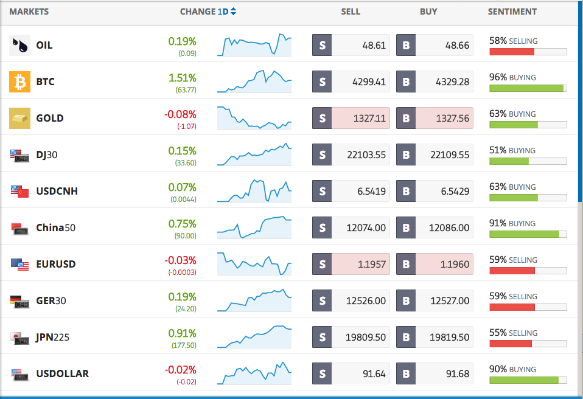

# 交易所報價功能
## 報價列表 watchlist
* 商品列表

* (Optional)商品搜尋

## 詳細報價
* 線圖
    * 一般折線
    * K線(candle stick)
    * 美國線(line)
    * 區間選擇（1m, 5m, 30m, 60m, 1D, 1W)
    * 十字查價線
    * 常見指標（MACD, MA, RSI)

* 大字報價

## (Optional)分時明細

## (Optional)分價量表

## (Optional)警示通知

## (Optional)商品排行與篩選

